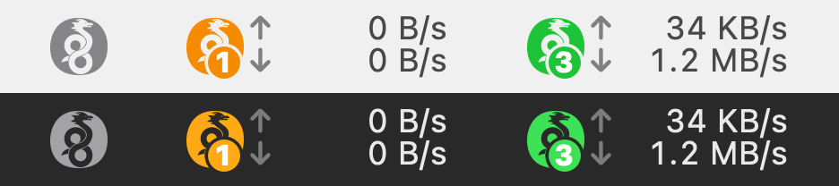

# WGMenu

[](LICENSE)


A macOS menu-bar app that runs **multiple WireGuard tunnels at once**. The official WireGuard app allows only one active tunnel.



*The menu-bar label in its gray (off), orange (connecting / no data) and green (receiving) states.*

## Features

- **Multiple simultaneous tunnels**: one switch per config in `/etc/wireguard`, plus Disconnect All.
- **State-colored logo**: the WireGuard logo, tinted gray when nothing is up, orange while connecting or when an up tunnel has received no data for 180 s, green when every up tunnel is receiving.
- **Up count** in a small disc over the logo's lower loop.
- **Live ↑/↓ speed** (total) next to the logo, refreshed every 5 s.
- **Per-tunnel details**: status dot, speed, last handshake and transferred bytes.
- **Import / Edit / Delete configs** from the menu. Each asks for your admin password.
- **Launch at login**.

## Requirements

- Apple Silicon Mac, macOS 13 (Ventura) or later
- [Homebrew](https://brew.sh)
- Xcode Command Line Tools: `xcode-select --install`
- An administrator account (for `sudo wgmenu-setup`)
- `/usr/local` owned by root (setup refuses if a legacy Intel Homebrew left it user-owned; fix: `sudo chown root:wheel /usr/local; sudo chmod go-w /usr/local`)

## Install

```sh
brew install kapong/tap/wgmenu
sudo wgmenu-setup
open /Applications/WGMenu.app
```

Then choose **Import Config…** in the menu and pick your `.conf` files (for example, tunnels exported from the official WireGuard app). The tunnel name is the file name without `.conf` (1–15 characters: letters, digits, `_ = + . -`).

## Upgrade

```sh
brew upgrade wgmenu
sudo wgmenu-setup
```

Also re-run `sudo wgmenu-setup` after upgrading `wireguard-tools`, `wireguard-go` or `bash`: it refreshes the root-owned copies of those tools. Quit and reopen WGMenu after an upgrade; if **Launch at login** stops working, turn it off and on again.

## Uninstall

```sh
sudo wgmenu-setup --uninstall
brew uninstall wgmenu
```

Your configs stay in `/etc/wireguard`.

## Build from source

```sh
brew install wireguard-tools bash
git clone https://github.com/kapong/WGMenu.git
cd WGMenu
./build.sh            # as your normal user -> build/WGMenu.app
sudo ./wgmenu-setup   # copies the app to /Applications
```

`sudo ./wgmenu-setup --uninstall` removes it. The build uses `swiftc` from the Command Line Tools; no Xcode project.

## How it works / Security

WireGuard needs root to bring tunnels up. WGMenu keeps that surface small:

- **Narrow root helper.** `wgmenu-setup` installs `/usr/local/sbin/wgctl` (root-owned) and a sudoers rule that lets your user run only that helper without a password. The helper does four things: `list`, `status`, `up NAME`, `down NAME`. Names are validated and must match a config in `/etc/wireguard`.
- **No tools from user-writable paths.** `/opt/homebrew` is writable by your user, so the passwordless helper never runs anything from it. Setup copies `wg-quick`, `wg`, `wireguard-go` and `bash` (with its libraries) into root-owned `/usr/local/libexec/wgmenu`. Before every call, the helper checks that those files and their parent directories are root-owned and not writable by others, and runs them with a clean environment.
- **Configs always need your password.** Configs hold private keys, and `wg-quick` runs their `PreUp`/`PostUp`/`PreDown`/`PostDown` lines as root. A passwordless write would be passwordless root, so reading, writing and deleting configs is never part of the helper. Import, Edit and Delete each ask for your admin password.
- **Hook warning.** If a config contains `PreUp`/`PostUp`/`PreDown`/`PostDown`, WGMenu warns that those commands run as root and asks you to confirm before saving it.
- **Locked config directory.** `/etc/wireguard` is `root:wheel 700` and configs are `600`.
- **What you still trust.** `wgmenu-setup` copies the tools from Homebrew at the moment you run it, so it trusts what Homebrew installed then, like any `sudo` of a brew-installed tool; re-run it after upgrades. The passwordless rule applies to your account, so any process running as you can bring tunnels up and down, including the hooks of configs you already imported. Only import configs you trust. Each 5-second status poll goes through `sudo` and is logged.

## Tips and limitations

- Tunnels must not have overlapping `AllowedIPs`.
- Only one tunnel may route `0.0.0.0/0` (full tunnel).
- Set `DNS` in at most one config.
- Don't run the same tunnel in the official WireGuard app at the same time.
- An idle tunnel without keepalives receives nothing and turns orange after 3 minutes. Add `PersistentKeepalive = 25` to its `[Peer]` section to keep it green.
- macOS may ask you to approve WGMenu under System Settings > General > Login Items.

## License

[MIT](LICENSE)

"WireGuard" and the "WireGuard" logo are registered trademarks of Jason A. Donenfeld. This project is not affiliated with or endorsed by WireGuard. https://www.wireguard.com/
